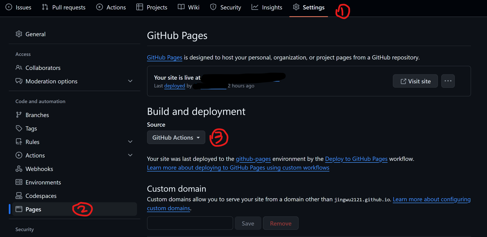

<div class="flex gap-2 justify-center mt-10">
<span>[](/blog/zh/00-academic-astro-zh)</span>
</div>

In this post, I am going to walk you through every step to build a research personal website from scratch and deploy it on Github using [[this](https://github.com/jingwu2121/astro-micro-academic)] template. 

## Prerequisites

- VSCode
- Node.js and Npm [[Install Here](https://nodejs.org/en/download/package-manager)]
    - Node.js: v18.17.1 or v20.3.0 or higher use `node -v` to check your node version. 
    - Npm package manager: check version with `npm -v`
- Git: Make sure git is installed by running `git -v` in your terminal. 
---

## Installation

Create a new folder for your code and in side the folder, right click to `Git bash here`.  


Clone the repo in the bash 

```bash 
git clone https://github.com/jingwu2121/astro-micro-academic.git
```
Open the folder in VSCode, and enter the repo in the terminal 
```bash
cd astro-micro-academic
```
Install all the required modules, which are listed in `package.json`. 
```bash 
npm i
```
Run the local server, and click the `localhost` link in the terminal. 
```bash 
npm run dev
```

## File Structure
I would like to introduce a bit more about Astro if you are super new to front-end development. 
Astro is a component-based Static Site Generator, just like react, where everything is a component, which can be reused to avoid redundancy. For example, we will have a `Header` and `Footer` component, and we just add them on every page, instead of keeping repeating headers and footers on every page. 

Here, the `public` folder includes public assets on your website, e.g. images, which can normally be downloaded directly from the website. `src` folder contains all the codes and your blog posts for the website, which are invisible to website viewers. However, here, we are going to deploy our website on github, so all the files are actually public. (Unless you have a Github Pro Account) 

- `components` contains different 'react' components of the website, which is reusable. 
- `content` contains your posts. 
- `layouts` contains a universal layout for the website. 
- `pages` contains different pages. 
- `styles` stores the CSS files. (This project all uses TaillwindCSS framework)

```bash
|-- public
|-- src
    |-- components
    |-- content
    |   |-- blog
    |   -- publications
    |-- layouts
    |-- lib
    |-- pages
    |   |-- blog
    |   |-- publications
    |   -- tags
    |-- scripts
    |-- styles
```

## Modify the Website Content
### Website Content
Now that you have basic understanding for the file structure, it should be easy for you to change the content of the website to make it yours. :smirk:

I link files to different pages here, making it easier to modify the website as you like.  
- Header: `src/components/Header.astro`
- Footer: `src/components/Footer.astro`
- `Homepage`: `src/pages/index.astro`
- `blog`: `src/pages/blog/index.astro`
- `research`: `src/pages/publications/index.astro`
- `cv`: `src/pages/cv.astro`
- `about`: `src/pages/about.astro`
- `tags`: `src/pages/tags/index.astro`

Also play around the explore more and customize your website. :laughing: 

### Update Your Posts 
Store your blogs and publication cards in `src/content/blog` and `src/content/publications` as either Markdown files or MDX files. If your are not familiar with the Markdown Syntax, we have an example [here](https://astro-micro-academic.vercel.app/blog/04-markdown-syntax) and [one](https://astro-micro-academic.vercel.app/blog/05-mdx-syntax) for MDX, created by Astro-Micro. 

Make sure to structure your blog as this and update the metadata as well. All the posts are sorted by date as a descending order. For publication cards, follow the example in the template repository. Do not remove `paperURL`, `codeURL`, `webURL`, `dataURL`, even if you don't have the URL, just leave the link part blank, e.g. `codeURL: "Code: "` then it won't appear on the website. Note that, there is a space after the colorForIntegration. 

## Deploy Your Website 
Congratulations!! Now you have your website running locally! Wanna make it seen by the world? You need to deploy your website. There are several solutions to this. The most common way is to deploy to Github. Besides this, you can also deploy it to hosts like [Vercel](https://docs.astro.build/en/guides/deploy/vercel/) or [Netlify](https://docs.astro.build/en/guides/deploy/netlify/). More information [here](https://docs.astro.build/en/guides/deploy/). They have free plans for you to use. 

Here, we are going to deploy the site to Github using Github Action. 

### Build & Preview
You can build your website locally and preview it by running

```bash 
npm run build

npm run preview
```
After building the website, all the auto generated HTML files will be stored in `dist` folder. 

### Config

Now, let's actually deploy the website, first configure your `astro.config.mjs`. 

```mjs
import { defineConfig } from 'astro/config'

export default defineConfig({
  site: 'https://<username>.github.io',
  base: 'my-repo',
})
```
Remove the base argument if you are going to deploy to the root. With the base, you will deploy the site you `my-repo` repository and eventually your website link will be `https://<username>.github.io/my-repo`

### Deploy Script 

Then, add the deploy script to your `package.json`

```json 
"deploy": "npm run build && gh-pages -d dist",
```


### Github Action

Then, add Github Action Workflow to your repo. Create a new file in your project at `.github/workflows/deploy.yml` and paste in the YAML below. What Github Action does is to repeat the `npm run build` in the Github site, which will generate something like `dist` folder as well. But in this case, this generated 'dist' folder has a seperate branch `gh-pages` after building the website. Your website runs on this branch. 

```yaml 
name: Deploy to GitHub Pages

on:
  # Trigger the workflow every time you push to the `main` branch
  # Using a different branch name? Replace `main` with your branch’s name
  push:
    branches: [ main ]
  # Allows you to run this workflow manually from the Actions tab on GitHub.
  workflow_dispatch:

# Allow this job to clone the repo and create a page deployment
permissions:
  contents: read
  pages: write
  id-token: write

jobs:
  build:
    runs-on: ubuntu-latest
    steps:
      - name: Checkout your repository using git
        uses: actions/checkout@v4
      - name: Install, build, and upload your site
        uses: withastro/action@v2
        # with:
          # path: . # The root location of your Astro project inside the repository. (optional)
          # node-version: 20 # The specific version of Node that should be used to build your site. Defaults to 20. (optional)
          # package-manager: pnpm@latest # The Node package manager that should be used to install dependencies and build your site. Automatically detected based on your lockfile. (optional)

  deploy:
    needs: build
    runs-on: ubuntu-latest
    environment:
      name: github-pages
      url: ${{ steps.deployment.outputs.page_url }}
    steps:
      - name: Deploy to GitHub Pages
        id: deployment
        uses: actions/deploy-pages@v4
```

### Finishing Your Github Repo Setting 
Now go to your repo `Settings`, under the `Pages` table, in `Build and deployment`, `source`, select `Github Actions`. 


### Push your code :laughing: 

Now, push your code, the site will automatically starts building and deploying. Navigate to `Actions` tab to see the progress. 

Congratulations!! :tada: :tada:
Go to `https://<username>.github.io` or `https://<username>.github.io/my-repo` to have a look at your live website!